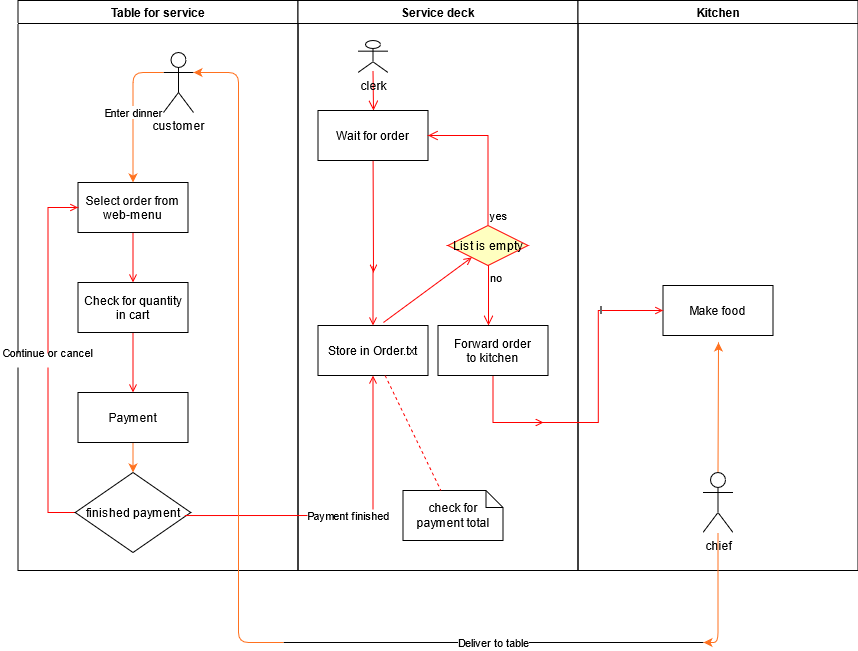
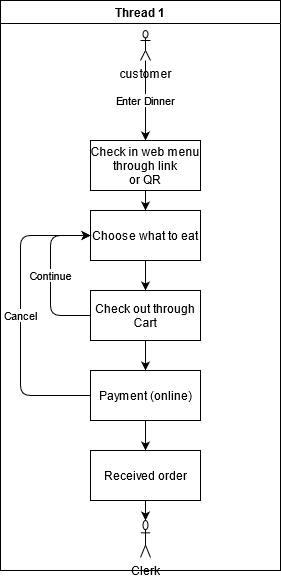

# Task1

## Task 1.1 `:`

---

Relevant stakeholders:

* Restaurant owner
* customer
* Web developers
* Order handling clerk
* Kitchen `(`chief`)`

The product should provide the following service`:`

* In store ordering
* In store cancellation
* Record of order form customer
* list of customers' order of **1** day
* Total sell of **1** day  
* Online payment
* Timer for pick up

The scope should first be limited to **1** restaurant as a pilot, with the intention to expand to a **chain** of restaurant.

---

## Task1.2 `:`

---

The functional requirement of the project should be as follow`:`

* Displaying available food for ordering
* Adding food to a *cart* for ordering
* Provide online method of payment
* Able to cancel an order
* scheduling order in FIFO

The non-functional requirement of the project should be as follow `:`  

* Product list and payment should be reusable
* Product is accessible through mobile or pc web browser
* The product should ve able to record at least 300 order in a `.txt`(or `.JSON`,or in a data base) file, with the following format`:` Table, order `:` quantity  
* The render time should not take any longer than **10** second  
* Should not require login from customer
* Final payment should add tax
* Product displayed should be able to display detail about ingredient for customer
* Every product should be able to be ordered from front page
* Need not more than 5 action to complete ordering

Demo use-case diagram`:`

Demo use-case diagram for food ordering`:`

Showcase in table`:`

|Preconditions |Customer is already seated in table |
|---|---|
|Post condition | Clerk receive customer order
|Trigger | Customer wants to order some food|
|Main scenario| Customer choose from web menu  then check for quantity in cart  The order is finished proceed to payment   Create order in txt file after payment
|Extension| If during payment customer decide co cancel go back to menu page
